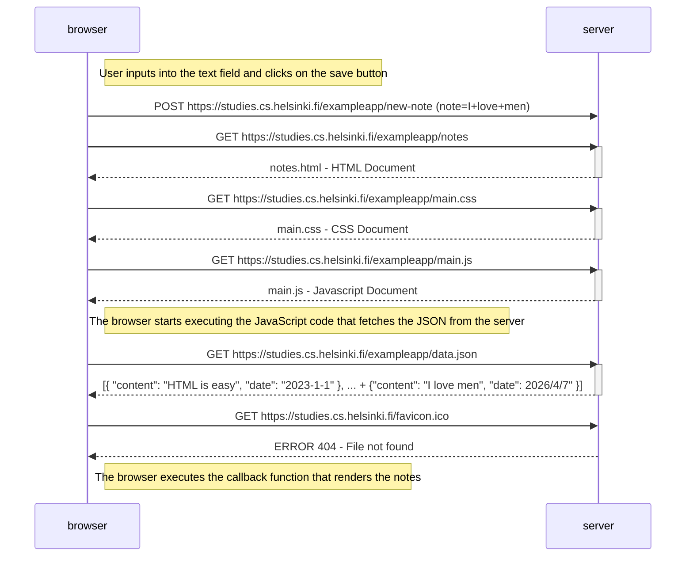

```mermaid
sequenceDiagram
    participant browser
    participant server

    Note right of browser: User inputs into the text field and clicks on the save button
    browser->>server: POST https://studies.cs.helsinki.fi/exampleapp/new-note  (note=I+love+men)

    browser->>server: GET https://studies.cs.helsinki.fi/exampleapp/notes
    activate server
    server-->>browser: notes.html  - HTML Document
    deactivate server

    browser->>server: GET https://studies.cs.helsinki.fi/exampleapp/main.css
    activate server
    server-->>browser: main.css  - CSS Document
    deactivate server

    browser->>server: GET https://studies.cs.helsinki.fi/exampleapp/main.js
    activate server
    server-->>browser: main.js - Javascript Document
    deactivate server

    Note right of browser: The browser starts executing the JavaScript code that fetches the JSON from the server

    browser->>server: GET https://studies.cs.helsinki.fi/exampleapp/data.json
    activate server
    server-->>browser: [{ "content": "HTML is easy", "date": "2023-1-1" }, ... + {"content": "I love men", "date": 2026/4/7" }]
    deactivate server

    browser->>server: GET https://studies.cs.helsinki.fi/favicon.ico
    server-->>browser: ERROR 404 - File not found
    Note right of browser: The browser executes the callback function that renders the notes
```